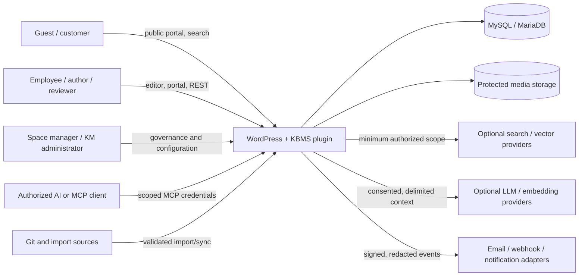
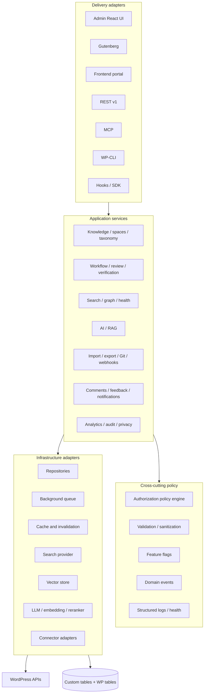
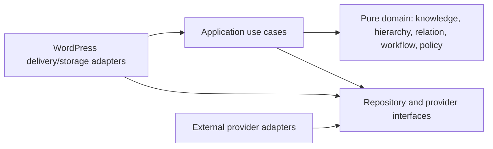
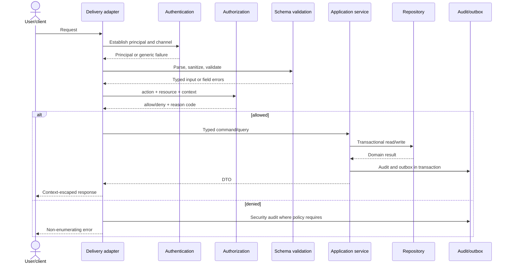
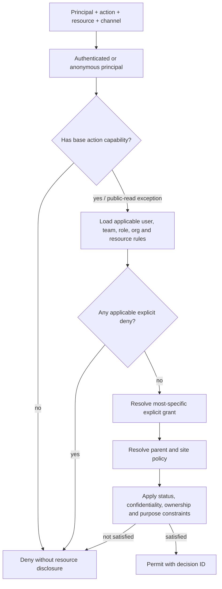
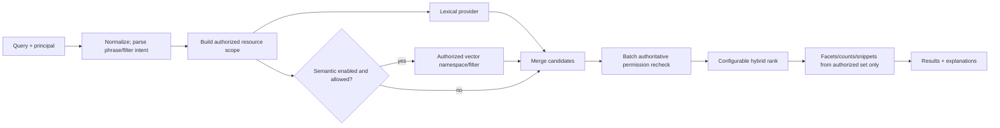
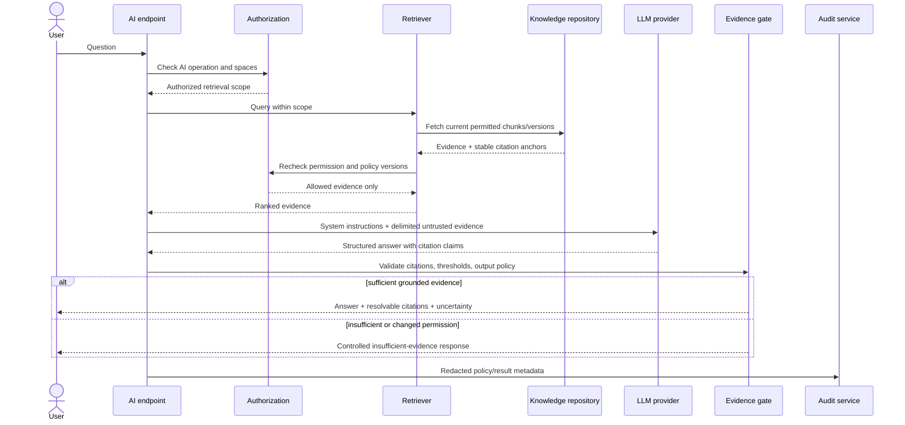
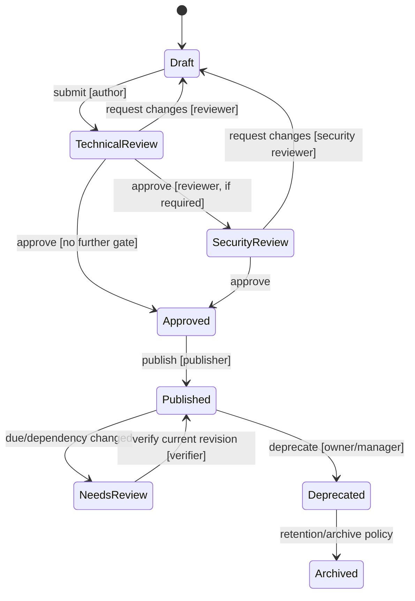
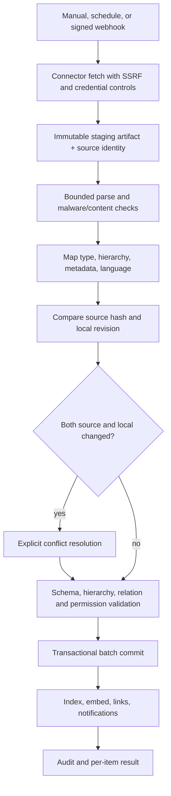
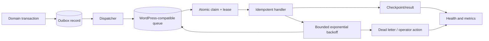

# Architecture overview

Status: **Target architecture with a shipped 0.1.0 foundation.** The system context and invariants remain the long-term design. The as-built release currently implements the modular composition root, hybrid storage, central authorization, native search provider, AI/provider ports and grounded pipeline, workflows, audit, relationships/graph API, portal/admin surfaces, maintenance, health, and privacy modules. Target-only components such as Git, MCP, full connectors, semantic adapters, and the interactive graph client are explicitly deferred in the RTM.

## Architectural goals

The platform is a modular monolith inside WordPress, with provider ports for capabilities that may move out of process. Native WordPress storage and lexical discovery form the always-available baseline. AI, semantic search, graph visualization, Git synchronization, MCP, advanced analytics, and external search are feature-flagged adapters. Authorization is a domain service invoked at every delivery channel and before retrieval, never delegated to an external provider or an LLM.

The design priorities are security and privacy, data integrity, correct and explainable authorization, knowledge reliability, usability/accessibility, maintainability, then scale and extension.

## System context

Trust boundaries exist at every browser request, REST/MCP endpoint, uploaded/imported artifact, outbound HTTP call, provider adapter, webhook, queue payload, cache, and protected attachment delivery. Stored knowledge is untrusted content for rendering and for AI prompt construction.

## Major components

### Module dependency rules

- Domain code must not call WordPress globals, SDKs, HTTP, or SQL.
- Delivery adapters translate requests into application commands/queries and must not contain business rules.
- Provider adapters implement stable ports; domain/application code does not import vendor SDK types.
- Modules communicate through application interfaces and domain events. Direct cross-module table writes and circular dependencies are forbidden.
- Security-sensitive events use an outbox so committed state and subsequent jobs cannot silently diverge.

## Request and data flow

## Authorization model and flow

Effective access combines an action capability with resource policy. Explicit deny wins; otherwise the most specific applicable rule wins; otherwise inheritance proceeds document → category/collection → space → site default. Public access is an explicit grant, not absence of a restriction. See [permissions matrix](permissions-matrix.md).

Authorization decisions are reused as immutable scopes by repositories/search adapters, but caches are keyed by principal policy version and resource policy version. Permission changes increment versions, invalidate caches, remove or re-scope index/vector records, and update protected file grants before emitting success.

## Search flow

The default adapter may offer a reduced feature set but must support correct permission filtering. Counts, spell suggestions, autocomplete, related items, caches, headings, attachment names, and timing behavior must not disclose unauthorized knowledge. Verification/freshness are ranking guardrails so popularity cannot elevate stale, unverified content above policy thresholds.

## AI/RAG flow

No unauthorized candidates may be sent to an LLM and then “filtered” from its answer. A permission change during generation invalidates the response if any selected source policy version changed. Prompt content cannot grant tools or alter system instructions. External processing requires configured consent and excludes sensitive spaces by policy.

## Workflow flow

Actual state machines are configurable per space/type/category/sensitivity. Every transition has an allowed-source set, required capabilities, optional separation-of-duties and approval quorum, optimistic concurrency token, invariant checks, transactional revision/event/audit writes, and idempotency key.

## Import and Git synchronization flow

Source identity plus revision/hash prevents duplicate imports. Partial failures are reported per item and resumable. Imports never publish by default unless a trusted connector policy explicitly permits it. Git force-pushes and renames are detected; conflicts never silently overwrite either side.

## Background-job flow

Jobs carry opaque object IDs, expected versions, policy versions, feature flags, attempt count, idempotency keys, and correlation IDs—not secrets or full private AI context. Handlers re-authorize system actions and re-read current state. Disabling a feature prevents new work and safely cancels/no-ops pending optional work.

## Deployment and scalability

The initial deployment is one WordPress plugin and database. Progressive scale points are:

1. Small: WordPress-native lexical search, Action Scheduler-compatible queue adapter, object cache optional.
2. Medium: dedicated tables and aggregates, persistent object cache, external search/vector adapters, worker-backed cron.
3. Large: external search/vector services and connector workers while WordPress remains the policy/control plane and source of portable core knowledge.

Default WordPress search is not represented as suitable for 500,000 items. Load testing at 500, 25,000, and architecture-validation at 500,000 items is required before scale claims.

## Security and privacy invariants

- Deny by default and authorize every channel independently: admin, portal, REST, AJAX, search, graph, AI, attachment, export, webhook, MCP, CLI.
- Use prepared queries, strict schemas, context-specific output escaping, nonces for browser CSRF protection, and capabilities for authorization.
- Validate MIME by content; private files use authorized streaming or provider-signed short-lived URLs, never guessable public media URLs.
- Outbound URLs permit only approved schemes/hosts, resolve and re-check redirects, and block local/link-local/private network ranges unless explicitly allowlisted.
- Secrets stay server-side, are masked after save, never logged/exported, and use encryption-at-rest where key management is available.
- Audit history is append-only to ordinary users, tamper-evident where practical, retained by policy, and privacy-aware.
- Deactivation preserves data; uninstall deletion requires explicit opt-in and confirmation.
- Logs are structured and redacted; client errors never expose stack traces, SQL, provider secrets, or private context.

## UX information architecture

Admin navigation uses one top-level Knowledge application with Dashboard, Spaces, Knowledge, Requests, Reviews, Workflows, Graph, Search, AI, Analytics, Integrations, Users & Access, Templates, Glossary, Imports / Exports, Audit, and Settings. Health and operational tools live in the relevant dashboard/settings views rather than adding excessive WordPress top-level items. Visibility depends on capability. The frontend provides portal home, space/collection/category trees, knowledge pages, search, glossary, recents/popular pages, and optional AI assistant.

Every asynchronous or data view requires loading, empty, partial, error, stale, retry, and permission-revoked states. Relationship lists are the accessible fallback for graph visualization. Primary workflows require keyboard operation, meaningful focus order/errors, WCAG 2.2 AA contrast, reduced motion, localization, and purpose-built RTL layouts.

## Testing boundaries

Unit tests cover pure policy, hierarchy, workflow, ranking, and value objects. WordPress integration tests cover schema/repositories/hooks/capabilities/privacy. Contract tests cover provider/connector adapters. REST and MCP tests enumerate authentication, schema, capability, BOLA/IDOR, pagination, and non-disclosure. Browser/E2E tests cover primary workflows, keyboard accessibility, responsive/RTL behavior, and conflict handling. Security fixtures must prove a user cannot infer a secret via any delivery path. Performance tests use the brief’s small/medium/large data profiles.

No such tests currently exist or have been run.
