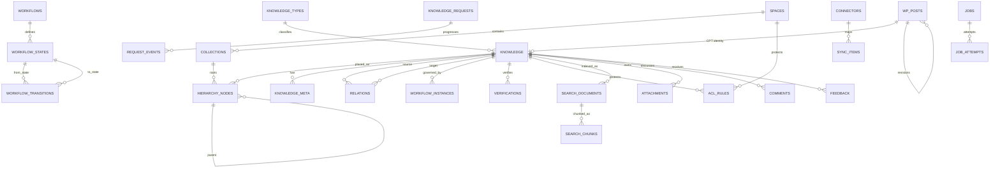

# Data model

Status: **0.1.0 schema implemented; expanded model below is target-state.** `InitialSchema` installs the following per-site tables through `dbDelta`, and `Migrator` records schema version `1`:

| Table | Purpose | Key indexes |
|---|---|---|
| `kbms_spaces` | Space identity, owner, visibility, bounded settings | unique slug, visibility, owner |
| `kbms_space_members` | User-to-space role | primary space/user, user, role/space |
| `kbms_knowledge_meta` | Queryable governance projection for `kbms_item` posts | space/state, owner, reviewer, review, expiry, verification |
| `kbms_workflows` | Versionable state/transition definitions | space/enabled |
| `kbms_workflow_events` | Append transition history | post/time, workflow |
| `kbms_audit_log` | Structured append audit events | time, actor/event, object, correlation |
| `kbms_relationships` | Typed directed knowledge edges | unique edge, source/type, target/type |
| `kbms_feedback` | Helpfulness/comment workflow | post/time, status/time, user |
| `kbms_analytics_daily` | Privacy-minimized daily aggregates | metric/date, object/date |
| `kbms_jobs` | Retryable bounded work records for future handlers | claim tuple, type/status |

WordPress `posts`, revisions, postmeta, and the `kbms_type`/`kbms_topic` taxonomies hold portable authored content. Foreign keys are enforced by services rather than database constraints for WordPress host compatibility. The remainder of this document describes the larger target model and should not be read as already migrated tables.

## Storage strategy

Core authored knowledge uses a custom post type and WordPress revisions to preserve Gutenberg compatibility, media integration, and ecosystem behavior. High-volume, relational, security-critical, queue, analytics, graph, and provider state uses dedicated tables. Queryable metadata must not be scattered into unindexed `postmeta`; stable high-cardinality fields use dedicated rows/columns. JSON is reserved for bounded extensibility payloads, not primary relationships.

Database foreign keys are not assumed because WordPress deployments vary; repositories and migrations enforce foreign-key-like constraints, indexes, and deletion policy transactionally.

## Entity relationship overview

## Core and hierarchy tables

| Table/entity | Important columns | Keys and indexes | Retention/deletion behavior |
|---|---|---|---|
| `wp_posts` (`kbms_knowledge` CPT) | WordPress post/revision fields; block content | WordPress-managed | Trash/retention policy; revisions retained by governance settings. |
| `kbms_knowledge` | `post_id`, `space_id`, `type_id`, `owner_user_id`, `owner_team_id`, `status`, `verification_status`, `confidentiality`, `language`, `canonical_id`, `published_revision_id`, `policy_version`, `row_version`, timestamps | PK `post_id`; indexes `(space_id,status)`, `(owner_user_id,status)`, `(verification_status,next_review_at)`, `(language,canonical_id)` | Soft delete/tombstone before policy-driven purge; authorship preserved if a user is removed. |
| `kbms_spaces` | `id`, `site_id`, `name`, `slug`, owner, visibility, default language, branding/config refs, `policy_version`, timestamps | PK; unique `(site_id,slug)`; owner/visibility indexes | Archive by default; deletion requires dependent-object plan. |
| `kbms_collections` | `id`, `space_id`, `name`, `slug`, description, `sort_order`, `row_version` | unique `(space_id,slug)`; `(space_id,sort_order)` | Reparent/archive dependents; never silently orphan. |
| `kbms_hierarchy_nodes` | `id`, `space_id`, `collection_id`, `kind`, `object_id`, `parent_id`, `slug`, `path`, `depth`, `sort_order`, `row_version` | unique `(parent_id,slug)`; `(space_id,path)`; `(parent_id,sort_order)` | Cycle checked on write. Moves add redirect records before path update. |
| `kbms_redirects` | old path/context, target object/path, status code, created/expiry | unique old path; target index | Retain while inbound references or policy requires. |
| `kbms_knowledge_types` | identifier, label, icon, JSON schema, presentation/workflow/review refs, active/version | unique identifier | Deactivate rather than delete while used. Schema changes versioned. |
| `kbms_meta_definitions` | key, value type, validation, searchable/filterable/faceted flags, sensitivity, version | unique key | Deprecate/version; prevent incompatible removal while used. |
| `kbms_knowledge_meta` | `knowledge_id`, `definition_id`, typed scalar columns or bounded JSON, language | PK/unique by cardinality; type-specific indexes only when queryable | Follows knowledge retention; secrets are prohibited. |
| `kbms_taxonomies` / `kbms_terms` / `kbms_term_links` | per-space vocabulary definitions, hierarchical terms, object links | unique slugs within taxonomy/parent; lookup indexes | Cycle-safe term moves; preserve redirects where public URLs change. |

`site_id`/`blog_id` must be explicit on custom tables if tables are network-global; otherwise per-site prefixes provide isolation. Cross-site queries are denied unless a later ADR explicitly designs network scope.

## Relations, reuse, graph, and localization

| Table | Important columns | Constraints/indexes | Notes |
|---|---|---|---|
| `kbms_relation_types` | key, inverse key, directed, acyclic, source/target node masks, active | unique key | Encodes whether an inverse row is stored or derived. |
| `kbms_relations` | source type/id, relation type, target type/id, provenance, creator, timestamps | unique source/type/target; reverse target index | Validate endpoint visibility/integrity; cycle checks for acyclic types. |
| `kbms_components` | type, key, current revision, status, policy scope | unique key per scope | Variables/snippets/shared blocks are revisioned. |
| `kbms_component_usage` | component/revision, consumer knowledge/revision, location | unique reference; consumer and component indexes | Enables impact analysis; expansion has depth/recursion limit. |
| `kbms_graph_nodes` | node type, object ID, label cache, policy version | unique type/object; type index | Derived projection; source object remains authoritative. |
| `kbms_graph_edges` | relation ID or derived provenance, source/target nodes, edge type | source/type and target/type indexes | Never returned without endpoint and edge authorization. |
| `kbms_translations` | canonical knowledge, source/target language, source revision, translation revision, translator, status, synchronized timestamp | unique canonical/target language; status index | Source revision change marks translations stale. |
| `kbms_glossary` | term, definition knowledge/revision, acronym, language, owner, status | normalized term/language and synonym indexes | Rendering excludes code/pre/script contexts. |

## Governance and collaboration

| Table | Important columns | Constraints/indexes | Notes |
|---|---|---|---|
| `kbms_workflows` | scope, name, version, active | scope/name/version | Published versions immutable; instances pin a version. |
| `kbms_workflow_states` | workflow/version, key, label, terminal flags | unique workflow/version/key | State removal blocked while referenced. |
| `kbms_workflow_transitions` | from/to, capability, conditions, quorum, separation rules | unique workflow/version/from/action | Conditions use a constrained rules model, not executable PHP. |
| `kbms_workflow_instances` | knowledge/revision, workflow/version, current state, row version | unique active instance per knowledge; state index | Optimistic locking prevents double transitions. |
| `kbms_workflow_events` | instance, transition, actor, from/to, revision, idempotency key, timestamp, notes | unique idempotency key; time/object indexes | Append-only governance record. |
| `kbms_verifications` | knowledge, revision, verifier, status, notes, next review | knowledge/revision/time indexes | Only the exact revision is verified. |
| `kbms_review_assignments` | knowledge/revision, reviewer, due, state, decision | reviewer/state/due | User removal invokes reassignment policy. |
| `kbms_comments` | knowledge/revision/anchor, parent, author, status, body, resolved metadata | knowledge/status and assignee indexes | Sanitized rich text; orphan anchors remain visible after edits. |
| `kbms_follows` / `kbms_bookmarks` | principal, target type/id, preferences | unique principal/target | Erased/anonymized under privacy policy. |
| `kbms_feedback` | knowledge/revision, rating/reason, actor pseudonym, text, status | knowledge/time/reason | Never exposes restricted titles through analytics. |
| `kbms_knowledge_requests` | requester, title/question, urgency, audience, product, owner, workflow state | state/owner/urgency indexes | Attachments inherit request permissions. |
| `kbms_request_events` | request, actor, from/to, event, timestamp | request/time | Append-only lifecycle. |
| `kbms_notifications` | recipient, event, object reference, channel, state, attempts, timestamps | recipient/state/time | Payload is minimized; deletion follows retention settings. |

## Authorization, security, and audit

| Table | Important columns | Constraints/indexes | Notes |
|---|---|---|---|
| `kbms_teams` / `kbms_team_members` | team identity; user, role, validity | unique team slug; unique team/user; user index | Deleted users removed from membership; ownership remediation is separate. |
| `kbms_acl_rules` | resource type/id, subject type/id, effect, action mask, conditions, specificity, validity | resource and subject indexes; unique normalized rule | Explicit deny wins. Rules are versioned/audited. |
| `kbms_policy_versions` | resource/principal scope, monotonic version | unique scope | Cache/index tokens change on permission updates. |
| `kbms_api_credentials` | credential ID, owner, scopes, encrypted secret/token hash, last-used, expiry, revoked | credential hash/owner/expiry | Secret is displayed once; never stored plaintext where avoidable. |
| `kbms_audit_log` | event ID, actor/pseudonym, action, object, channel, result, correlation, metadata hash/redacted JSON, timestamp, previous hash | time, object/time, actor/time, action/time | Append-only to app users; retention/legal-hold aware; secrets/private context prohibited. |
| `kbms_rate_limits` | privacy-preserving principal/bucket key, window, count | bucket/window | Atomic update; bounded retention. |

## Search, AI, analytics, and operations

| Table | Important columns | Constraints/indexes | Notes |
|---|---|---|---|
| `kbms_search_documents` | knowledge/revision, provider ID, title/headings/body projection, metadata, policy version, index status/hash | unique provider/knowledge/revision; status index | Projection contains only authorized-scope tags; stale policy versions are rejected. |
| `kbms_search_chunks` | document, stable section anchor, ordinal, content hash, token estimate, policy version | document/ordinal, hash | Content may live only in external vector store; deletion is tracked. |
| `kbms_embedding_records` | chunk, provider/model/dimension, external vector ID, content/policy hash, state | unique chunk/provider/model; state index | Model change creates a new generation; never silently mixes dimensions. |
| `kbms_search_events` | minimized query hash/text per policy, result bucket, clicked object if permitted, pseudonym, timestamp | time/outcome indexes | Retention/anonymization configurable; restricted titles never leak into aggregate output. |
| `kbms_ai_events` | operation, provider/model, authorized space set hash, source count, grounded outcome, latency/cost estimate, redacted error | time/outcome/provider | Full private prompts/context off by default. |
| `kbms_analytics_daily` | date, metric, permitted dimension keys, value | unique date/metric/dimensions | Rebuildable aggregates; small-cell suppression prevents inference. |
| `kbms_connectors` | type, config reference, credential ID, state, cursor, policy, last sync | type/state | Credentials stored separately. |
| `kbms_sync_items` | connector, external ID/path, source hash/revision, local object/revision, direction, state, conflict data | unique connector/external ID; local index | Idempotency and rename/conflict tracking. |
| `kbms_webhook_endpoints` | URL, encrypted signing secret, subscribed events, state, failure count | state | SSRF checks on create and delivery. |
| `kbms_webhook_deliveries` | endpoint/event, payload hash, attempt, timestamp, status, response summary | endpoint/time/status; unique event/endpoint | Replay-safe event IDs and bounded response logging. |
| `kbms_jobs` | queue/type, object reference, expected/policy versions, idempotency key, state, priority, availability, lease, attempts | unique handler/idempotency; claim index | No secrets/full content in payload. |
| `kbms_job_attempts` | job, attempt, start/end, result, redacted error | job/attempt | Retention configurable. |
| `kbms_outbox` | event ID/type, aggregate/version, minimal payload, created/dispatched | unique event ID; undispatched index | Written in the domain transaction. |
| `kbms_migrations` | version, checksum, state, cursor, attempts, timestamps, redacted error | PK version | Ordered, retry-safe, batch-aware. |

## Attachment model

WordPress media may store public files. Restricted files require `kbms_attachments` metadata with knowledge/revision, storage adapter/key, original and safe display name, detected MIME, size/hash, scan state, extraction state, policy version, and retention state. Downloads flow through authorization and audit before streaming or issuing a short-lived scoped URL. Extracted text, thumbnails, indexes, and embeddings inherit the exact source policy and purge lifecycle.

## Integrity and concurrency rules

- Hierarchy and acyclic relation changes run a cycle check and use a transaction/lock appropriate to the storage engine.
- All mutable aggregates have a monotonic `row_version`; update commands require the expected version and return a conflict instead of overwriting.
- Unique source IDs, event IDs, and idempotency keys make imports, transitions, webhooks, and jobs retry-safe.
- Publishing pins a revision. Verification, citations, translation currency, search chunks, and exports reference explicit revisions.
- Derived stores carry source content and policy hashes. A mismatch causes exclusion and repair, not stale delivery.
- Deletes create tombstones and enqueue derived-store cleanup. Purge completion is observable across search, vector, cache, files, exports, and connector mappings.

## Migration strategy

1. Plugin bootstrap reads a schema version, acquires a bounded migration lock, and runs ordered migrations.
2. DDL and backfills are separately versioned; large backfills are resumable batches with a cursor.
3. Each migration records checksum, attempt, timestamps, and redacted error. Retry-safe guards verify actual schema state.
4. Deployments use expand/migrate/contract: add compatible shape, dual-read/write if necessary, backfill, switch reads, then remove only in a later breaking-release policy.
5. Activation must work against populated older schemas. Deactivation never deletes data. Uninstall purge is opt-in, capability checked, nonce protected, previewed, and auditable.

## Open data decisions

- Minimum supported WordPress/PHP/MySQL/MariaDB versions.
- Per-site tables versus network-global tables in multisite.
- Queue implementation shipped in core versus adapter dependency.
- Encryption key source and rotation mechanism for credentials.
- Whether comments use WordPress comments or a dedicated table after workload/security validation.
- Exact native-search projection and language-specific full-text behavior.

These are intentionally unresolved rather than presented as implementation facts.
